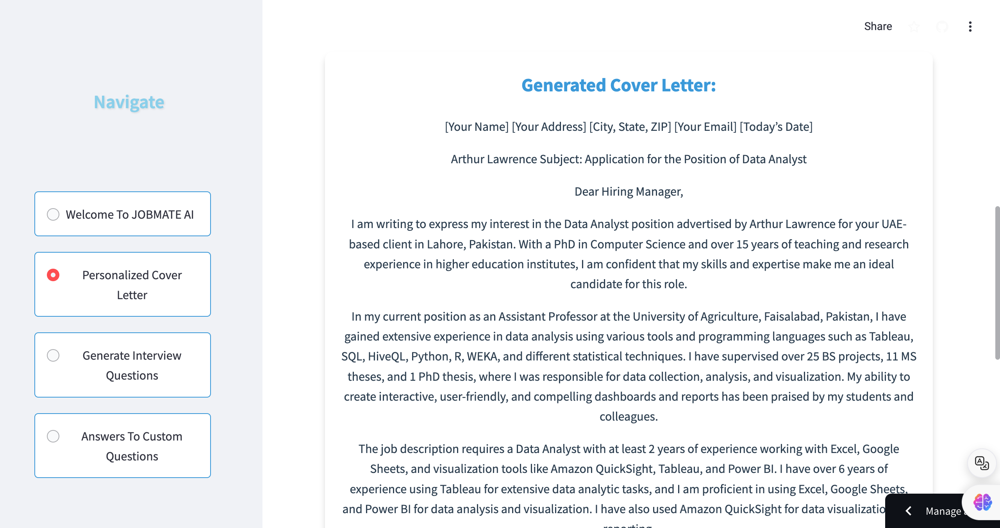
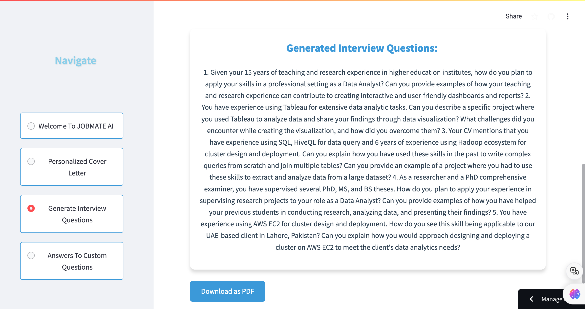

# 🌟 JobMate AI: Your Path to Professional Success

Welcome to **JobMate AI**! This application leverages AI to assist with job applications by generating personalized cover letters, interview questions, and answers to custom questions based on your CV and job descriptions. Powered by Groq's API, the app ensures that you are well-prepared for your job search.

## 🚀 Features

- ✍️ **Personalized Cover Letter**: Automatically generate a cover letter tailored to a specific job description and your CV.
- 📝 **Interview Preparation**: Receive customized interview questions based on your job application details.
- ❓ **Answer Custom Questions**: Get AI-powered answers to your specific job-related queries.

## 🧠 AI Tech Stack

- **Groq API**: The app uses Groq’s advanced API to generate text via the Llama-based `llama3-8b-8192` model.
- **RAG (Retrieval-Augmented Generation)**: This is a method used to enhance text generation by retrieving and utilizing relevant content for more accurate and context-aware outputs.
- **Streamlit**: Used for building the frontend UI of the application.
- **Document Processing**: Includes libraries like `PyPDF2` and `docx` to process and extract information from PDFs and DOCX files.
- **ReportLab**: Utilized for generating downloadable PDFs, such as cover letters and interview questions.

## ⚙️ Deployment

### 1. 🛠️ Set Up the Project Locally

- Install necessary Python libraries:
  ```bash
  pip install streamlit groq PyPDF2 python-docx reportlab
  ```

- Configure your **Groq API Key** by adding it to the secrets in Streamlit. The key should be added under `GROQ_API_KEY` in the `secrets.toml` file.

### 2. ☁️ Deploying to Streamlit Cloud

- **Step 1**: Fork the repository or create a new one in your GitHub.
- **Step 2**: Go to [Streamlit Cloud](https://streamlit.io/cloud) and log in.
- **Step 3**: Select "New app" and connect it to your GitHub repository.
- **Step 4**: Specify the main Python file to run, usually `app.py` or the file with `main()` function.
- **Step 5**: Add your `GROQ_API_KEY` in Streamlit Cloud's secret management system.
- **Step 6**: Deploy the app!

### 3. 🖥️ Running the App Locally

If you want to test the app locally before deployment, simply run:

```bash
streamlit run app.py
```

## 🔧 Tech Stack Used

- **Frontend**: Streamlit for building an interactive web interface.
- **Backend**: Flask is used as a backend server to process the AI requests.
- **AI Model**: Groq's `mixtral-8x7b-32768` Llama-based model is used for generating cover letters, interview questions, and custom question answers.
- **Document Processing**: PyPDF2 and python-docx for reading uploaded files, and ReportLab for generating PDFs.
- **CSS Styling**: The app uses enhanced styling with CSS animations and 3D effects.

## 📂 How the App Works

1. **User Inputs**:
   - Upload your **CV** (PDF or DOCX).
   - Provide the **Job Description** (either as a text or file).
   
2. **AI Generation**:
   - Groq’s API generates the personalized **cover letter** or **interview questions**.
   
3. **Download Options**:
   - You can download the generated cover letter or interview questions as a **PDF**.

## 👀 Demo

### Personalized Cover Letter Generation:

### Interview Questions Generation:


## ✨ Contributions and Future Updates

- We welcome contributions to enhance the app’s features and performance.
- Future updates may include integration with other job application platforms.

## 📝 License

This project is licensed under the MIT License.
